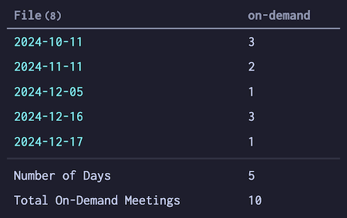

<p markdown="1" class="notice">
<span class="audience">Assumed audience</span> People at least passably familiar with Obsidian. See [my other notes on Obsidian]() for more context.<br/>
In particular, you might see:  
- [[obsidian-plugins]]  
- [[beginning-to-use-obsidian]]  
</p>

## What is the Dataview plugin?  

[Dataview](https://blacksmithgu.github.io/obsidian-dataview/) lets your Obsidian notes act like a database. It not only has its own query language built-in, but you can also use Javascript if you know-slash-dare. This means that it's able to tell you many things about your notes, **if** you're able to invoke the questions correctly.  

Thankfully, people like [S Blu](https://github.com/s-blu) have made documentation in the form of an [Example Vault for Dataview Queries](https://s-blu.github.io/obsidian_dataview_example_vault/) and a [Basic Dataview Query Builder](https://s-blu.github.io/basic-dataview-query-builder/)!  

To extend this collective knowledge, I'll share some of my own uses for Dataview.  

## Events in a Year  

Here's a query that's particularly useful at the end of a year. (In fact, I'm typing this note up in the evening, after submitting a yearly review earlier in the day.) I'll explain the situation and the structure of my notes first; the actual code is [a bit further down](#the-working-query).  

### Query Context and Notes Structure

On my team at work, we're each available for individual on-demand appointments with faculty. The frequency of appointments is highly variable, so I'll sometimes go for a week without any, while other times I'll have three or more in a single day.  

I keep daily notes in Obsidian and annotate each day's note with how many of these appointments occurred that day, along with a number of other annotations that are basically just binary "did I do the thing or didn't I?" sort of indicator.  

In each day's note, an annotation follows the Dataview convention: the entire annotation is in a single pair of square brackets, and the name of the thing being tracked (or the "key") is separated from the associated value by two colons. So if I have three of these appointments on a particular day, that annotation looks like: `[on-demand:: 3]`. These annotations can go anywhere in the note, but I tend to collect them all under a collapsible heading near the top of the note. To my mind, this sort of works as metadata for the day.  

### Desired Results

For this query, I wanted to show these three things:  
1. a list of the specific days in a specific time frame (a calendar year) with one of these on-demand appointments,  
2. a count of these specific days, and  
3. the total number of these appointments.  

After a little bit of trial & error, I managed to modify S Blu's [Show a sum row for numeric values and durations](https://s-blu.github.io/obsidian_dataview_example_vault/20%20Dataview%20Queries/Show%20a%20sum%20row%20for%20numeric%20values%20and%20durations/) pattern to work with my own note structure. However, I noticed that the place that should show **how many days** was two numbers too high.  

I asked my spouse, who has far more Javascript familiarity than I do, and she helped me understand what was happening and customize Su Blu's query even further.  

We added only three lines, the ones that start with:  
- `// emily & ryan` (line 25),  
- `const. numDaysRow =` (line 26), and  
- `DQL.values.push(numDaysRow)` (line 30).  

After all this, here's how the results will appear:
  

Each of the 5 dates shown in the left column is a working link to that day's note, and the numbers in the right "on-demand" column are the total number of on-demand appointments for that day. (Yep, I made these numbers up for this demonstration. The actual ones are far higher.)  

However, you might notice that at the top of the left column, the header reads `File(8)`. But wait… 8 is a full 3 higher than the actual count of 5 days! This inaccurate `8` apparently isn't the number of files, but rather the number of rows in this table—including the horizontal rule row between the list of files and the bottom two totals rows. **This miscount weirdness** inspired the "Number of Days" row we added to the code, since the actual query based on my year of appointments was far too long to count at a glance.  

The first row below the table counts the number of relevant days (i.e. the row doesn't count any day without at least 1 on-demand appointment). The final row adds up the appointments. Using this made-up data, you can see that between these 5 days, I "had" 10 total on-demand meetings.  

### The Working Query

The `FROM` line will vary according to how you set up your own daily notes. I use the [Periodic Notes plugin](https://github.com/liamcain/obsidian-periodic-notes) to generate my daily notes; if you use Obsidian's default or some other plugin, the pattern your query needs will almost certainly be different.  


```dataviewjs
// Paste your DQL for the table here, with the FROM and WHERE customized for your own notes structure and your query's specific annotation key:
const query = `TABLE on-demand
FROM "_pj/2024/2024dd"
WHERE on-demand > 0`
// change the name of the total row, if you like:
const nameOfTotalRow = "Total On-Demand Appointments";

// you don't need to touch this, normally.
// get the data from the query above
let DQL = await dv.tryQuery(query);
const sums = [nameOfTotalRow];
// for each header (except the first one, which is "File")...
for (let i = 1; i < DQL.headers.length; i++) {
    let sum = 0;
    // ... and for each row ...
    for (let k = 0; k < DQL.values.length; k++) {
        // get the current cell (row k and column i) and add it to the sum, if set
        let currentValue = DQL.values[k][i];
        if (currentValue) sum += currentValue 
    }
    if (!sum) sum = ""
    sums.push(sum);
}
// emily & ryan teach this to count, not just add
const numDaysRow = ["Number of Days", DQL.values.length]
// add a divider line for visual distinction between the query and the sums (thanks, Jillard!), add both to the table data
let hrArray = Array(DQL.headers.length).fill('<hr style="padding:0; margin:0 -10px;">');
DQL.values.push(hrArray)
DQL.values.push(numDaysRow)
DQL.values.push(sums)
//print the table
dv.table(DQL.headers, DQL.values)
```


There you go, hopefully just in time to help you out with whatever end-of-year reflections you also might be working on.  