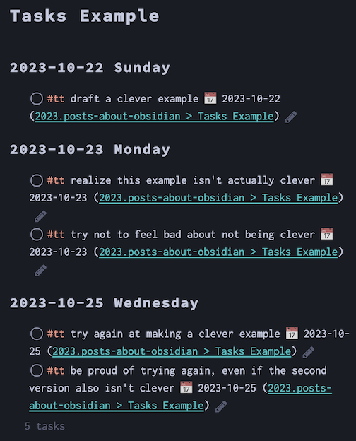

<span class="audience">Assumed audience</span> People at least passably familiar with Obsidian. See [my other notes on Obsidian]() for more context.
{: .notice }

## What's the Big Deal about Obsidian Plugins?  

One of the best—and most anxiety-producing, from the viewpoint of long-term stability—aspects of Obsidian is how the developers have opened up the app to community plugins. These plugins extend the core behaviors in various ways.  

While your notes are ultimately just a bunch of Markdown files, the plugins can perform so-called "dynamic queries". In hopefully simpler terms, the plugins let you add instructions to the "source code" of the note that tell the plugin to query, or **search for something** (like search for tasks in some or all of your notes), and these instructions can be rendered **dynamically**, or on the fly, differently in the "reading view" or "live preview" of the note (like actually showing the list of tasks you've specified in your query).  

<span id="tasks-example">For example,</span> if the "source code" of a note contains the following instructions:  
`````
```tasks 
not done 
starts before tomorrow
(tags do not include #waiting)
group by happens
```
`````

Then the "reading view" or "live preview" of the note can display a list of tasks from any of your Obsidian notes, nicely grouped together by day, and with optional links back to the original note that contains the task. 

Here is an example with five different tasks, grouped into headings under three different days:  


This means your notes can take on the behavior of databases or task-management systems—yet still retain all the cross-app portability and longevity of text files!  

## My Shortlist  

When I first looked at Obsidian years ago, I was frustrated by the lack of obvious ways to customize the look, feel, and behavior. Both for better and for worse, the app's core developers have allowed community members to create plugins. This is great in terms of allowing for a wider variety of customizations than a small handful of official developers can support. But it's simultaneously worrisome to have some of the most crucial elements of my everyday experience be outsourced to volunteers in the community.  

In any event, I figured I'd write a list of some of the plugins I find most essential for my own experience, in case it helps save other people frustration in setting up Obsidian to work for them.  

Here's an alphabetical list of the Obsidian plugins I rely on most frequently.  

- Linter  
- Periodic Notes  
- Style Settings  
- Tasks  
- Templater  

### Linter  

You might be familiar with the concept of a [linter](https://en.wikipedia.org/wiki/Lint_(software)) if you've used code editors. They're handy for enforcing stylistic preferences, such as whether to automatically delete all whitespace at the end of a line of text or to use tabs or spaces when indenting.  

Victor Tao's Linter plugin applies the same automatic formatting and stylization to your notes in Obsidian. I have it set to lint on save, to make sure that heading levels only increase by a single level at a time, and do similar things.  

**Timestamps** are by far the most important of these actions for me. I want my notes to be as self-contained as possible, so I want to be able to easily see when a note was last updated from within the note itself. The plugin's [YAML Timestamp rule](https://platers.github.io/obsidian-linter/settings/yaml-rules/#yaml-timestamp) handles this wonderfully. I use both a `created` and a `modified` key for this. And since ISO 8601 is the [XKCD-approved format](https://xkcd.com/1179/) for all things time-y, the format I use is `YYYY-MM-DD[T]HH:mm:ss[-06:00]`. (If you're not also in Mountain Time, you'd probably want to change the `[-06:00]` offset there. But hey, you do do!)  

It's even possible to apply "lint on save" even on mobile! "Mobile" is the first item in the settings menu of the Mobile app, and it lets you manage the toolbar options available in the mobile app. I've made the first one be "Save current file." I don't know if it's possible to apply an icon there, but having it first is easy to enough to remember.  

Here's the plugin's [website](https://platers.github.io/obsidian-linter/) and its [GitHub repository](https://github.com/platers/obsidian-linter).  

### Style Settings  

This one is made by [Matthew Meyers](https://matthewmeye.rs/), who has made a number of other Obsidian plugins. It's known on GitHub as [Obsidian Style Settings](https://github.com/mgmeyers/obsidian-style-settings) and is listed within the app itself just as Style Settings.  

Other themes, such as Chris Geiser's [Shimmering Focus](https://github.com/chrisgrieser/shimmering-focus/), rely on it as a common interface for their own theme settings.  

Depending on the theme, this plugin will allow you to specify things like various colors, fonts, font sizes, how backlinks are displayed, and whether to hide or display entire sections of the app interface.  

### Periodic Notes  

Obsidian has a built-in [Daily notes plugin](https://help.obsidian.md/Plugins/Daily+notes), which might be sufficient for many people.  

Liam Cain's [Periodic Notes plugin](https://github.com/liamcain/obsidian-periodic-notes) adds the ability to create weekly, monthly, quarterly, or yearly notes, each with different templates. You can see and navigate these in the Calendar pane, and even create new ones directly by clicking on that day or week.  

### Tasks  

Originally written by Martin Schenck and now expertly maintained by Clare Macrae, the [Tasks plugin](https://github.com/obsidian-tasks-group/obsidian-tasks) is honestly what made me ultimately switch from Dendron to Obsidian for the bulk of my notes.  

It lets you track and display tasks in various ways. I'll eventually write a whole separate note on how I use it. For now, you can see the [example above](#tasks-example) for a quick overview of what it can do.  

Beyond that, for now I'll just link to its [documentation site](https://publish.obsidian.md/tasks/Introduction), which might be the best I've ever seen or used.  

### Templater  

Originally written by SilentVoid13, the [Templater plugin](https://github.com/SilentVoid13/Templater) allows for things beyond what Obsidian's built-in [Templates plugin](https://help.obsidian.md/Plugins/Templates) provide. I think maintenance of it has been taken over by [Zach Young](https://zachyoung.dev/), aka [Zachatoo](https://github.com/Zachatoo), who provides excellent guidance to it in the Obsidian Discord.  

This is another plugin that I might eventually write a whole separate note on how I use it, since its features and behaviors are far from self-explanatory to non-coders.  